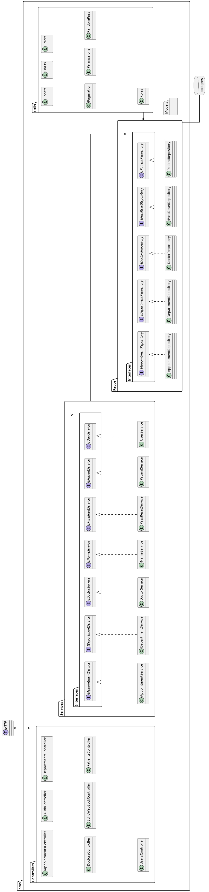

# Hospital Management System (BackEnd)

## Introduction

This project shall be a backend application covering the domain of hospital
management, specifically doctor-patient appointments. The scope shall be limited
to only doctor-patient appointments, and anything necessary to manage these.

The project shall be referred to as `HMS` in this document.

---

## Description

`HMS` shall be a backend-only application, a frontend is not a part of the
application. It shall be meant to run in a secure server environment, with
access to a PostgreSQL Database instance.

### Main Functions

The system shall have functions necessary for the following:

- Booking appointments
- Cancelling appointments
- Marking appointments as done

And ensuring proper role-based access to users.

### Users

Intended users of this system are:

- SuperAdmin - a system administrator, with knowledge of the `HMS` system.
- Admin - an administrator from the Hospital, responsible for managing users.
- Receptionist - Reception Desk attendant, to manage appointments on patients'
    behalf, and manage them.
- Patient
- Doctor

### Constraints

The system shall be developed with the following constraints:

- DotNet Core 8.0 C#
- AspNet Core
- PostgreSQL, latest stable version as of 4-August-2025
- Role Based Access Control system
- Following best practices of DotNet Core and AspNet Core
- Meainingful naming conventions

---

## Requirements

### Functional Requirements

The system shall fulfill the following functional requirements:

#### SuperAdmin/Admin

- Allow SuperAdmin/Admin to add any user of any role, except the with the role
    of a SuperAdmin.
- Allow SuperAdmin to add any user of any role, including that of a SuperAdmin.
- Allow SuperAdmin/Admin to modify any details of any user, except the username.
- Allow SuperAdmin/Admin to delete any user from the system.
- Allow SuperAdmin/Admin to change any user's password.

#### Receptionist

- Allow Receptionist to add new Patients into the system.
- Allow Receptionist to book appointments with doctors on behalf of Patients.
- Allow Receptionist to cancel booked appointments.
- Allow Receptionist to view appointments.

#### Doctor

- Allow Doctor to view only those appointments that concern them.
- Allow Doctor to mark scheduled appointments as Done.
- Allow Doctor to cancel scheduled appointments.

#### Patient

- Allow Patient to view their appointments
- Allow Patient to cancel their appointments

#### General

- The system shall require log-in to view any information, or carry out any
    action, besides logging in.
- The system shall allow any logged in user to change their password, provided
    they are able to provide their current password as well.
- The system shall allow any user, even those not logged in, to be able to
    reset their password via a One-Time-Password.

### Non-Functional Requirements

- The system shall respond with appropriate messages in case of invalid input.
- The system shall respond with appropriate status codes in case of any
    abnormal request.
- The system shall protect Patient's information from leaking.

---

## Interfaces

The system shall make use of 3 interfaces:

- REST API over HTTP(s) protocol
- PostgreSQL via Npgsql
- Stdout/Stderr for logging system information

---

